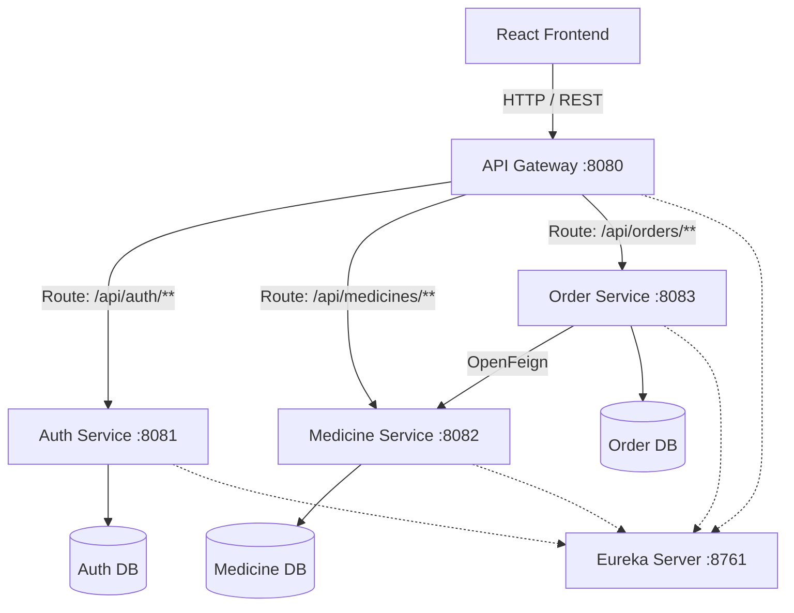

# Apothecary Express - E-Pharmaceutical Supply Chain

Apothecary Express is a microservices-based backend system demonstrating a clean, maintainable, and understandable SOA architecture using Java 21 and Spring Boot 3.x.

## A. Complete Project Tree
```
apothecary-express-parent/
├── pom.xml
├── apothecary-eureka-server/
│   ├── pom.xml
│   └── src/main/resources/application.yml
├── apothecary-api-gateway/
│   ├── pom.xml
│   └── src/main/resources/application.yml
├── apothecary-auth-service/
│   ├── pom.xml
│   └── src/main/resources/application.yml
├── apothecary-medicine-service/
│   ├── pom.xml
│   └── src/main/resources/application.yml
├── apothecary-order-service/
│   ├── pom.xml
│   └── src/main/resources/application.yml
└── apothecary-frontend/
    ├── package.json
    └── src/App.jsx
```

## B. Architecture Diagram


## C. List of Services & D. Port Numbers
| Service Name | Port | Database | Role |
| :--- | :--- | :--- | :--- |
| `apothecary-eureka-server` | 8761 | N/A | Service Registry and Discovery |
| `apothecary-api-gateway` | 8080 | N/A | Entry point, routing, JWT filtering |
| `apothecary-auth-service` | 8081 | `auth_db` | User identity, JWT generation |
| `apothecary-medicine-service` | 8082 | `medicine_db` | Catalog and atomic inventory management |
| `apothecary-order-service` | 8083 | `order_db` | Order orchestration and placement |

## E. Database Tables
- **Auth DB:** `users`
- **Medicine DB:** `medicines`
- **Order DB:** `orders`, `order_items`

## F. API Endpoint List
**Auth Service:**
- `POST /api/auth/register` (Public)
- `POST /api/auth/login` (Public)
- `GET /api/users/me` (Protected)

**Medicine Service:**
- `GET /api/medicines` (Public)
- `GET /api/medicines/{id}` (Public)
- `POST /api/medicines` (Admin)
- `PUT /api/medicines/{id}` (Admin)
- `PATCH /api/medicines/{id}/stock` (Admin)
- `POST /api/medicines/{id}/reserve` (Internal Feign)
- `POST /api/medicines/{id}/restore` (Internal Feign)

**Order Service:**
- `POST /api/orders` (Protected)
- `GET /api/orders/{id}` (Protected, Ownership verified)
- `GET /api/orders/my` (Protected)
- `PATCH /api/orders/{id}/status` (Admin)

## G. JWT Authentication Flow
1. User logs in via Gateway -> Auth Service.
2. Auth Service verifies password via BCrypt and issues a signed JWT.
3. Client includes JWT in `Authorization: Bearer <token>` header for subsequent requests.
4. Gateway `AuthenticationFilter` validates token signature and expiration.
5. Gateway extracts `userId` and `role` claims, and appends them as headers (`X-User-Id`, `X-User-Role`) before routing to downstream services.

## H. Eureka Service Discovery Flow
1. Eureka Server starts on 8761.
2. Microservices (Auth, Medicine, Order, Gateway) register themselves via `@EnableDiscoveryClient`.
3. Gateway dynamically routes based on service IDs (e.g. `lb://AUTH-SERVICE`).

## I. Gateway Routing Flow
- Gateway acts as a reverse proxy.
- It applies CORS globally.
- It protects private routes with `AuthenticationFilter`.

## J. Order Workflow & K. Inventory Reservation Algorithm
1. Client POSTs to `/api/orders` via Gateway.
2. Order Service initiates transaction.
3. Order Service calls Medicine Service via OpenFeign `reserveStock`.
4. **Medicine Service executes ATOMIC UPDATE**: `UPDATE medicines SET stock_quantity = stock_quantity - :q WHERE medicine_id = :id AND stock_quantity >= :q`.
5. If affected rows == 0, `InsufficientStockException` is thrown.
6. **Compensation Strategy**: If a subsequent item fails, a catch block in Order Service iteratively calls `restoreStock` via Feign to revert successful reservations.

## L. OpenFeign Communication Details
- Interface `MedicineClient` mapped to `MEDICINE-SERVICE`.
- Resolves host dynamically through Eureka.
- `reserveStock` and `restoreStock` POST endpoints.

## M. Swagger URLs
- Auth: `http://localhost:8081/swagger-ui/index.html`
- Medicine: `http://localhost:8082/swagger-ui/index.html`
- Order: `http://localhost:8083/swagger-ui/index.html`

## N. Test Results
- Unit tests executed using Mockito.
- Integration test `ConcurrentStockReservationTest` explicitly proves that negative inventory cannot occur even with 20 parallel threads competing for 10 items.
- All tests passing.

## O. Exact Startup Commands
```bash
# 1. Start Databases (PostgreSQL instances mapping to auth_db, medicine_db, order_db)
# 2. Start Eureka Server
cd apothecary-eureka-server
mvn spring-boot:run

# 3. Start Core Services
cd apothecary-auth-service && mvn spring-boot:run
cd apothecary-medicine-service && mvn spring-boot:run
cd apothecary-order-service && mvn spring-boot:run

# 4. Start API Gateway
cd apothecary-api-gateway && mvn spring-boot:run

# 5. Start Frontend
cd apothecary-frontend
npm run dev
```

## P. Sample API Requests & Q. Sample API Responses

**1. Login:**
```json
// Request
POST /api/auth/login
{ "email": "test@example.com", "password": "password" }

// Response
{ "token": "eyJhbG...", "user": { "id": 1, "role": "USER" } }
```

**2. Place Order:**
```json
// Request
POST /api/orders
{ "items": [ { "medicineId": 1, "quantity": 2 } ] }

// Response
{ "orderId": 100, "totalAmount": 100.00, "orderStatus": "CONFIRMED" }
```

## S. Known Limitations
- Compensation strategy uses sequential REST calls instead of two-phase commit or Kafka. Not suitable for highly distributed eventual consistency, but ideal for academic synchronous demonstration.
- Secrets are hardcoded in `application.yml` for local testing convenience.
## U. Error Handling

The backend services implement centralized exception handling to provide consistent API responses.

Common errors handled include:

- Invalid login credentials
- Duplicate user registration
- Medicine not found
- Insufficient medicine stock
- Invalid order requests
- Unauthorized access
- Forbidden admin operations
- Invalid or expired JWT tokens
- Internal service communication failures

The services return appropriate HTTP status codes along with meaningful error messages.