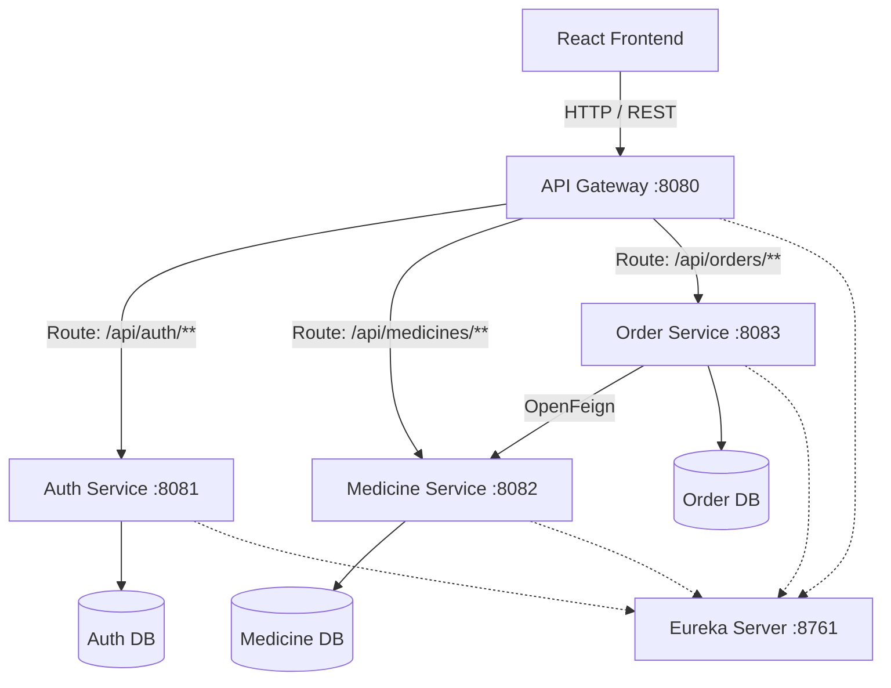

# 💊 Apothecary Express — E-Pharmaceutical Supply Chain

A microservices-based backend system demonstrating a clean, maintainable Service-Oriented Architecture (SOA) using **Java 21** and **Spring Boot 3.x**.

---

## 📖 Table of Contents

1. [Overview](#-overview)
2. [Core Business Flow](#-core-business-flow)
3. [Architecture](#-architecture)
4. [Services](#-services)
5. [Project Structure](#-project-structure)
6. [Database Schema](#-database-schema)
7. [API Reference](#-api-reference)
8. [Authentication Flow (JWT)](#-authentication-flow-jwt)
9. [Service Discovery (Eureka)](#-service-discovery-eureka)
10. [Gateway Routing](#-gateway-routing)
11. [Order Workflow & Inventory Reservation](#-order-workflow--inventory-reservation)
12. [Inter-Service Communication (OpenFeign)](#-inter-service-communication-openfeign)
13. [Getting Started](#-getting-started)
14. [API Documentation (Swagger)](#-api-documentation-swagger)
15. [Sample Requests & Responses](#-sample-requests--responses)
16. [Error Handling](#-error-handling)
17. [Testing](#-testing)
18. [Known Limitations](#-known-limitations)

---

## 🧾 Overview

**Apothecary Express** is a secure, microservices-based e-pharmaceutical supply chain and order fulfillment platform designed to manage users, medicines, inventory, and customer orders.

- Users can securely authenticate, browse available medicines, place orders, and track order status.
- Administrators can manage medicines, inventory, and order fulfillment.

A key requirement of the system is **accurate, real-time inventory management**. When an order is placed, the system verifies medicine availability and **atomically reserves** the required stock — preventing overselling even under concurrent order requests. If a stock reservation fails, the order is rejected and any previously reserved stock in that order is restored.

The system follows an **SOA architecture** using independent Spring Boot microservices:

| Component | Responsibility |
|---|---|
| **Auth Service** | User identity and JWT authentication |
| **Medicine Service** | Medicine catalog and inventory management |
| **Order Service** | Order processing and fulfillment |
| **API Gateway** | Single entry point for all client requests |
| **Eureka Server** | Dynamic service discovery and registration |

Inter-service communication between the Order Service and Medicine Service is handled via **OpenFeign**.

---

## 🔄 Core Business Flow

```
User
 ↓
React Frontend
 ↓
API Gateway
 ↓
JWT Authentication
 ↓
Order Service
 ↓
Medicine Service
 ↓
Check & Reserve Stock
 ↓
Create Order
 ↓
Order Tracking
```

---

## 🏗 Architecture



---

## 🧩 Services

| Service Name | Port | Database | Role |
|---|---|---|---|
| `apothecary-eureka-server` | 8761 | N/A | Service registry and discovery |
| `apothecary-api-gateway` | 8080 | N/A | Entry point, routing, JWT filtering |
| `apothecary-auth-service` | 8081 | `auth_db` | User identity, JWT generation |
| `apothecary-medicine-service` | 8082 | `medicine_db` | Catalog and atomic inventory management |
| `apothecary-order-service` | 8083 | `order_db` | Order orchestration and placement |

---

## 📁 Project Structure

```
apothecary-express-parent/
├── pom.xml
├── apothecary-eureka-server/
│   ├── pom.xml
│   └── src/main/resources/application.yml
├── apothecary-api-gateway/
│   ├── pom.xml
│   └── src/main/resources/application.yml
├── apothecary-auth-service/
│   ├── pom.xml
│   └── src/main/resources/application.yml
├── apothecary-medicine-service/
│   ├── pom.xml
│   └── src/main/resources/application.yml
├── apothecary-order-service/
│   ├── pom.xml
│   └── src/main/resources/application.yml
└── apothecary-frontend/
    ├── package.json
    └── src/App.jsx
```

---

## 🗄 Database Schema

| Database | Tables |
|---|---|
| Auth DB | `users` |
| Medicine DB | `medicines` |
| Order DB | `orders`, `order_items` |

---

## 🔌 API Reference

### Auth Service

| Method | Endpoint | Access |
|---|---|---|
| `POST` | `/api/auth/register` | Public |
| `POST` | `/api/auth/login` | Public |
| `GET` | `/api/users/me` | Protected |

### Medicine Service

| Method | Endpoint | Access |
|---|---|---|
| `GET` | `/api/medicines` | Public |
| `GET` | `/api/medicines/{id}` | Public |
| `POST` | `/api/medicines` | Admin |
| `PUT` | `/api/medicines/{id}` | Admin |
| `PATCH` | `/api/medicines/{id}/stock` | Admin |
| `POST` | `/api/medicines/{id}/reserve` | Internal (Feign) |
| `POST` | `/api/medicines/{id}/restore` | Internal (Feign) |

### Order Service

| Method | Endpoint | Access |
|---|---|---|
| `POST` | `/api/orders` | Protected |
| `GET` | `/api/orders/{id}` | Protected, ownership verified |
| `GET` | `/api/orders/my` | Protected |
| `PATCH` | `/api/orders/{id}/status` | Admin |

---

## 🔐 Authentication Flow (JWT)

1. User logs in via Gateway → Auth Service.
2. Auth Service verifies the password using **BCrypt** and issues a signed JWT.
3. Client includes the JWT in the `Authorization: Bearer <token>` header on subsequent requests.
4. Gateway's `AuthenticationFilter` validates the token's signature and expiration.
5. Gateway extracts the `userId` and `role` claims and forwards them as headers (`X-User-Id`, `X-User-Role`) to downstream services.

---

## 🧭 Service Discovery (Eureka)

1. Eureka Server starts on port `8761`.
2. Microservices (Auth, Medicine, Order, Gateway) register themselves via `@EnableDiscoveryClient`.
3. Gateway dynamically routes requests based on registered service IDs (e.g., `lb://AUTH-SERVICE`).

---

## 🚪 Gateway Routing

- Acts as a reverse proxy for all downstream services.
- Applies CORS policy globally.
- Protects private routes using `AuthenticationFilter`.

---

## 📦 Order Workflow & Inventory Reservation

1. Client sends `POST /api/orders` via the Gateway.
2. Order Service initiates a transaction.
3. Order Service calls Medicine Service's `reserveStock` via OpenFeign.
4. **Medicine Service performs an atomic update**:
   ```sql
   UPDATE medicines
   SET stock_quantity = stock_quantity - :q
   WHERE medicine_id = :id AND stock_quantity >= :q
   ```
5. If the affected row count is `0`, an `InsufficientStockException` is thrown.
6. **Compensation strategy**: If a later item in the order fails, a catch block in the Order Service iteratively calls `restoreStock` via Feign to revert any stock already reserved for that order.

---

## 🔗 Inter-Service Communication (OpenFeign)

- `MedicineClient` interface is mapped to `MEDICINE-SERVICE`.
- Host resolution is handled dynamically through Eureka.
- Exposes `reserveStock` and `restoreStock` as `POST` endpoints for internal use by the Order Service.

---

## 🚀 Getting Started

### Prerequisites
- Java 21
- Maven
- PostgreSQL (three instances/databases: `auth_db`, `medicine_db`, `order_db`)
- Node.js (for the frontend)

### Startup Sequence

```bash
# 1. Start PostgreSQL databases (auth_db, medicine_db, order_db)

# 2. Start Eureka Server
cd apothecary-eureka-server
mvn spring-boot:run

# 3. Start core services
cd apothecary-auth-service && mvn spring-boot:run
cd apothecary-medicine-service && mvn spring-boot:run
cd apothecary-order-service && mvn spring-boot:run

# 4. Start the API Gateway
cd apothecary-api-gateway && mvn spring-boot:run

# 5. Start the frontend
cd apothecary-frontend
npm run dev
```

> ⚠️ Start services in this order — Eureka first, then the core services, then the Gateway — so registration completes before routing begins.

---

## 📘 API Documentation (Swagger)

| Service | Swagger UI |
|---|---|
| Auth | `http://localhost:8081/swagger-ui/index.html` |
| Medicine | `http://localhost:8082/swagger-ui/index.html` |
| Order | `http://localhost:8083/swagger-ui/index.html` |

---

## 📤 Sample Requests & Responses

**Login**
```json
// POST /api/auth/login
{ "email": "test@example.com", "password": "password" }
```
```json
// Response
{ "token": "eyJhbG...", "user": { "id": 1, "role": "USER" } }
```

**Place Order**
```json
// POST /api/orders
{ "items": [ { "medicineId": 1, "quantity": 2 } ] }
```
```json
// Response
{ "orderId": 100, "totalAmount": 100.00, "orderStatus": "CONFIRMED" }
```

---

## ⚠️ Error Handling

The backend services implement **centralized exception handling** for consistent API responses. Common errors handled include:

- Invalid login credentials
- Duplicate user registration
- Medicine not found
- Insufficient medicine stock
- Invalid order requests
- Unauthorized access
- Forbidden admin operations
- Invalid or expired JWT tokens
- Internal service communication failures

Each error returns an appropriate HTTP status code along with a meaningful error message.

---

## ✅ Testing

- Unit tests written using **Mockito**.
- Integration test `ConcurrentStockReservationTest` verifies that **negative inventory cannot occur**, even with 20 parallel threads competing for 10 items.
- All tests passing.

---

## 🚧 Known Limitations

- The compensation strategy uses **sequential REST calls** rather than a two-phase commit or an event-driven approach (e.g., Kafka). This is suitable for a synchronous academic demonstration but not for highly distributed, eventually-consistent systems.
- Secrets are currently **hardcoded** in `application.yml` for local testing convenience — not suitable for production without externalizing them (e.g., via environment variables or a secrets manager).
